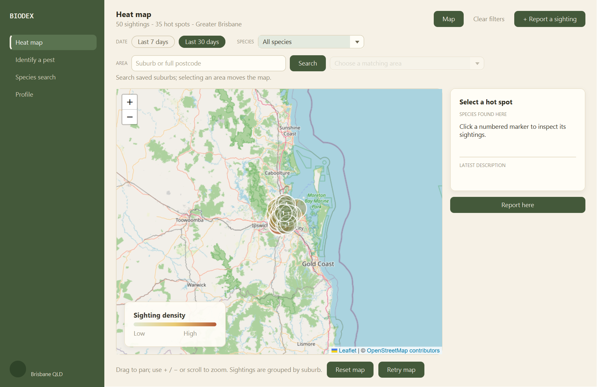
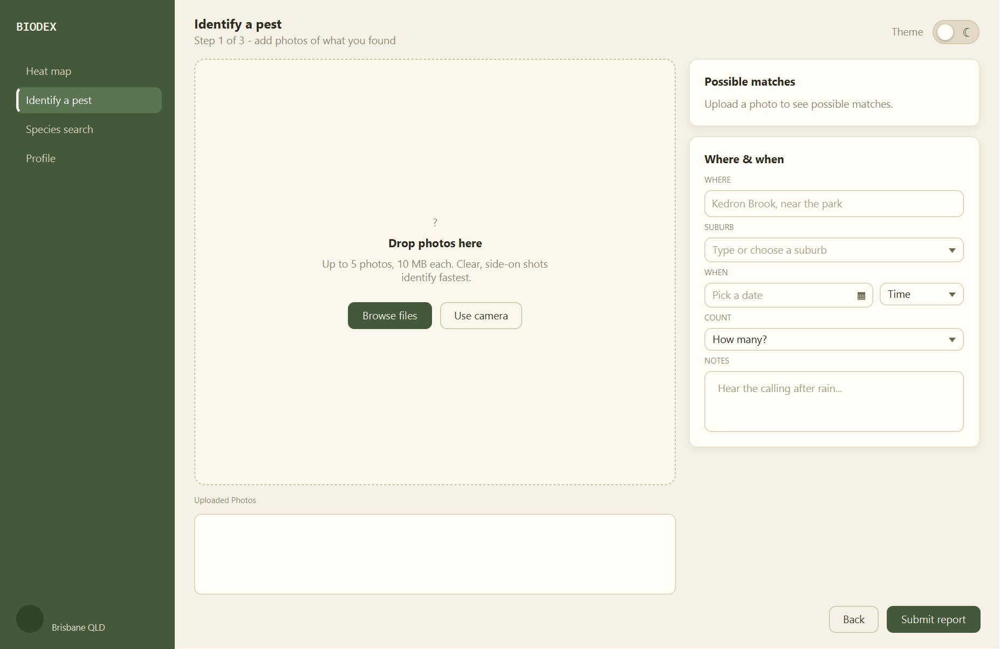

# Biodex - Invasive Species Tracker

[](https://github.com/tricuongdao/CAB302-Biodex/actions/workflows/build.yml)

Desktop application for reporting and tracking invasive species in South East Queensland. Add a photo of a pest, let the on-device model suggest the species, log the sighting, and see everything come together on a live heat map. Species profiles are backed by the Atlas of Living Australia.

Built as the CAB302 software development team project at QUT.



## Features

- **Pest recognition** - a bundled ONNX model classifies photos of the nine target species entirely on-device, showing ranked matches with confidence scores.
- **Sighting heat map** - a Leaflet map of Greater Brisbane with density hot spots. Filter by date range, species, or a suburb / postcode search; click a hot spot to inspect it, or report straight from that area.
- **Species library** - search nine curated pest species with photos and facts, plus live Atlas of Living Australia profiles (photos, descriptions, conservation status, taxonomy) for species outside the local database.
- **Reporting** - up to five photos per report, with a date picker, time, count, searchable suburb picker and notes. Saved sightings feed the heat map.
- **Accounts** - sign up, sign in, and a full password reset flow with verification codes.
- **Light and dark themes** - switchable from every screen.

| Sign in | Identify a pest |
|---|---|
|  |  |

## Build and run

JDK 17 or newer. Maven is not required, the bundled wrapper downloads it on first use.

| Task | Windows | macOS / Linux |
|---|---|---|
| Build: clean compile, full test suite, package the jar | `build.bat` | `./build.sh` |
| Run the app | `loader\run.bat` | `loader/run.sh` |

The build script writes the application jar to `target/biodex-1.0-SNAPSHOT.jar`. On first launch the app seeds its local SQLite database with the nine species, sample sightings around Brisbane and the suburb list, so the heat map has data to show.

## Automated build server

Every push to `main` and every pull request runs [`.github/workflows/build.yml`](.github/workflows/build.yml) on GitHub Actions: it compiles the project, runs the full JUnit suite and uploads the application jar as a build artifact. The badge above shows the latest status.

## Project layout

```
src/main/java/com/biodex/     application code (controllers, DAOs, services, recognition, routing)
src/main/resources/           FXML views, CSS themes, ONNX model, map assets
src/test/java/                JUnit test suite
docs/                         plans, mockups, screenshots, archived specifications
docs/technical-specs/         per-feature technical specifications
loader/                       launcher scripts and the Maven wrapper
build.sh / build.bat          one-command build, test and package
.github/workflows/            CI workflow
```

## Documentation

- Technical specifications: [auth and login](docs/technical-specs/login-signup-technical-spec.md), [2FA](docs/technical-specs/2FA.md), [forgot password](docs/technical-specs/forgot-password-technical-spec.md), [heat map](docs/technical-specs/heat-map-technical-spec.md), [pest recognition](docs/technical-specs/pest-recognition-integration.md), [species details](docs/technical-specs/pest-detail-technical-spec.md), [settings](docs/technical-specs/settings-page-technical-spec.md)
- Planning: [Release Plan.pdf](<docs/Release Plan.pdf>) and [Sprint Plan.pdf](<docs/Sprint Plan.pdf>)
- Historical: the combined specification snapshot lives in [docs/specifications-combined.md](docs/specifications-combined.md)

## Team

CAB302 team. See the pull requests for individual contributions: Vinny Dao, Ali Tehrani, Bernard, Dong Hyeon Uhm, Joshua, Tom, Yash Rao.

Team workflow notes live in [CONTRIBUTING.md](CONTRIBUTING.md).
